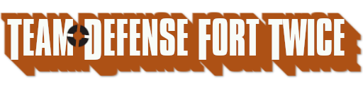

<h1 align="center">TheThunderGuyS's TF2 "dotfiles"</h1>

Here you will find various configuration files and custom content that I use while playing <a href="https://www.teamfortress.com/">Team Fortress 2</a>.

## My Own Content
### `./TheThunderHUD/`
The HUD I use. It's the default HUD with a few quality-of-life changes, and uses [CriticalFlaw's TF2-HUD-Fix](https://github.com/CriticalFlaw/TF2-HUD-Fix.git) as a base.

### `./img/defenseforttwice.png`
Source for the custom wordmark seen on the title screen in [TheThunderHUD](#thethunderhud). I made it using [GIMP](https://www.gimp.org/) by downloading the font and adding a long shadow, among other effects.

### `./hitsound/`
My hitsound of choice. It is the default [Quake III: Arena](https://en.wikipedia.org/wiki/Quake_III_Arena) hitsound, which I extracted from my own copy of [Quake Live](https://store.steampowered.com/app/282440/Quake_Live/) and uploaded to [my huds.tf page](https://huds.tf/site/s-Quake-Live-hitsound). I have it in a seperate VPK with a pre-generated soundcache, hence the sound being in its own subdirectory.

The cVars used with the hitsound are in [`./cfg/user/autoexec.cfg`](#cfguserautoexeccfg).

### `./endofthelinemusic/`
Source for [this mod I created](https://gamebanana.com/sounds/51743) which adds music from the [End of the Line community update](https://www.teamfortress.com/endoftheline/) to the list of tracks that will play when you start the game, alongside the rest of TF2's music.

### `./cfg/`
Configuration files and settings that I use alongside [mastercomfig](#mastercomfig).
#### `./cfg/binds.cfg`
Controls and binds, with comments explaining what they do.
#### `./cfg/tr_walkway_rc2.cfg`
A quick fix for the bots on the training map [tr_walkway](https://gamebanana.com/maps/107794).
#### `./cfg/user/`
mastercomfig's location for most scripts. It's mostly class configs with different class-specific cVar values and setups for binds.
##### `./cfg/user/modules.cfg`
[mastercomfig modules](https://docs.mastercomfig.com/en/latest/customization/modules/), used to override mastercomfig preset settings. Most have been set pretty low due to strange bottlenecks with my PC.
##### `./cfg/user/modules_fancy.cfg`
Modules that have been set to the maximum quality, which I use for screenshots and rendering demos.
##### `./cfg/user/autoexec.cfg`
Contains most of my settings not outlined in other files, and bind aliases.

## External Content
### [mastercomfig](https://mastercomfig.com)
mastercomfig is "A modern Team Fortress 2 performance and customization config" and provides many optimizations to significantly boost the performance of the game. Settings used to configure it can be found in [`./cfg/user/`](#cfguser).

I use the `medium-low` preset with the following addons:
- `null-cancelling-movement-addon`
- `no-tutorial-addon`
- `flat-mouse-addon`
- `disable-pyroland-addon`

The game also starts with the [recommended launch options](https://docs.mastercomfig.com/en/latest/customization/launch_options/).

### [Missing Killicons Pack](https://steamcommunity.com/sharedfiles/filedetails/?id=2156604959)
A mod that adds some killfeed icons which are missing from the game and otherwise display the generic skull icon. This mod works in casual mode.
